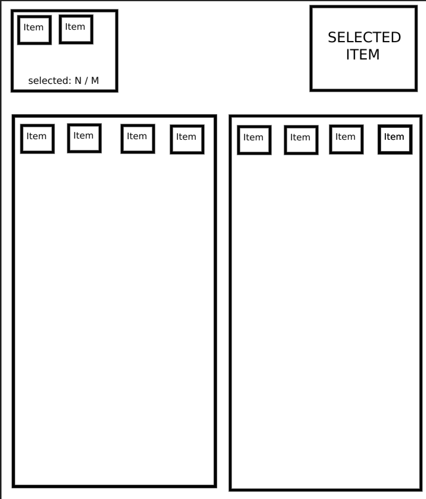

<!-- title: Тестовое задание -->
<p>
    <h1 align="center">Тестовое задание VueJS</h1>
    <br>
</p>

> После пуша Vue в ваш репозиторий, сделайте задание в любой другой ветке и PR в основную.  
> Подойдет как Vue2, так и Vue3

</br>




Задача: сделать рабочую страницу с изображения.

Дизайн не требуется. Достаточно схематичной страницы, как на изображении.

#### Блоки снизу:  
Слева - вещи у пользователя  
Справа - вещи на выбор

#### Блоки сверху:  
Слева - выбранные вещи из вещей пользователя (блок снизу-слева)  
Справа - выбранная вещь из вещей на выбор (блок снизу-справа).

Объекты вещей имеют одинаковую структуру, отличаются только названием и номером.

---

## Механика работы

Снизу-справа можно выбрать одновременно `только 1 вещь`, которая должна отображаться справа-сверху.

Снизу-слева можно выбрать `от 1 до 6 вещей`, которые должны отображаться в верхней левой части в порядке выбора.

---

Коллекции для заполнения нижних блоков слева и справа:

### Блок слева
```
[
    {
        "id": 1,
        "name": "Shoes 1"
    },
    {
        "id": 2,
        "name": "Shoes 2"
    },
    {
        "id": 3,
        "name": "Shoes 3"
    },
    {
        "id": 4,
        "name": "Shoes 4"
    },
    {
        "id": 5,
        "name": "T-shirt 1"
    },
    {
        "id": 6,
        "name": "T-shirt 2"
    },
    {
        "id": 7,
        "name": "T-shirt 3"
    },
    {
        "id": 8,
        "name": "T-shirt 4"
    }
]
```

### Блок справа
```
[
    {
        "id": 11,
        "name": "Jacket 1"
    },
    {
        "id": 12,
        "name": "Jacket 2"
    },
    {
        "id": 13,
        "name": "Jacket 3"
    },
    {
        "id": 14,
        "name": "Jacket 4"
    },
    {
        "id": 15,
        "name": "Hoodie 1"
    },
    {
        "id": 16,
        "name": "Hoodie 2"
    },
    {
        "id": 17,
        "name": "Hoodie 3"
    },
    {
        "id": 18,
        "name": "Hoodie 4"
    }
]
```